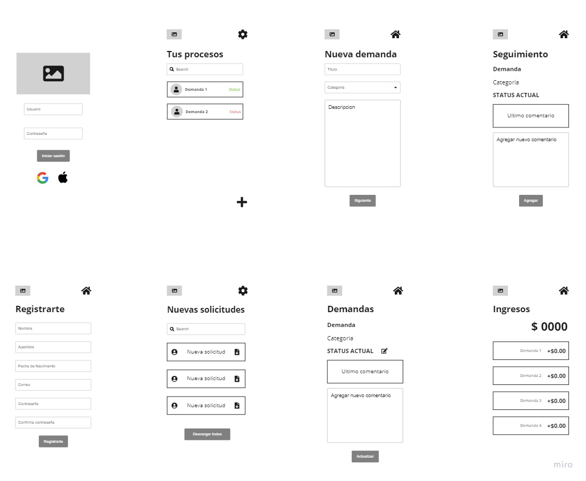
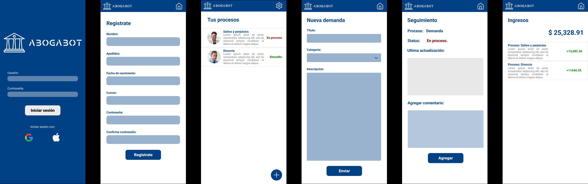

# Práctica Intro HTML

## Caso Abogabot

Descripción:
<ul>
<li>Es un despacho de abogados que quiere automatizar las demandas de sus clientes, esto lo harán a traves de una página web llenando un formulario.</li>

<li>Al momento de llenar el formulario se manda al proceso de pago para finalizar la transacción.</li>

<li>Para dar seguimiento a su demanda, el cliente crea una cuenta en la plataforma y verá el seguimiento de cada una de las actualizaciones del proceso legal.</li>

<li>El administrador del sitio recbe la notificación de una nueva demanda y con los datos llenados del formulario se crea automaticamente el documento legal en formato word para empezar el proceso.</li>

<li>El administrador recibe el pago y debe de ser capaz de verlo en un dashboard para ver la cantidad de ingresos recibidos.</li>

<li>El administrador actualiza el proceso de la demanda y agrega comentarios en cada paso del proceso.</li>

<li>Al usuario le llegan correos de notificación para saber el avance de su proceso.</li>

<li>La página debe de ser responsive para poderla ver desde el celular.</li>

<li>La preferncia de colores del cliente es azul marino y blanco, pero acepta propuestas.</li>

<li>Practicas
    <ul>
    <li>Toma de requerimientos</li>
    <li>Crea tu buyer persona</li>
    <li>Publico objetivo</li>
    <li>Crea tu primer Wireframe UX</li>
    <li>Ahora el UI</li>
    </ul>
</ul>

## Planteamiento

En primer punto intenté comprender las situaciones de uso de la aplicación web, las situaciones por las que los clientes deberán pasar cuando hagan uso de ella, de esta manera hacer una aplicación minimalista que ayude a optimizar los tiempos de uso. 
En cuanto a diseño se optó por mantener los colores que el cliente opto como principales propuestas, creando también un logotipo en los mismos colores que permita dar esa imagen de seriedad pero con una tipografía que haga referencia al uso de la tecnología.

## Toma de requerimientos:

<li>Sistema de login</li>
<li>Establecer roles de usuario</li>
<li>Formulario para demandas</li>
<li>Pago de transacciones</li>
<li>Sistema con notificaciones</li>
<li>Conversión del formulario a un formato Word</li>
<li>Dashboard de ingresos recibidos</li>
<li>Procesos de avance de las demandas (Estado actual)</li>
<li>Comentarios dentro de las demandas para los usuarios implicados</li>
<li>Diseño responsive</li>

## Buyer persona

Roberto Jiménez es un Lic. en derecho que actualmente tiene una concesionaria pequeña, en la cual recibe a muchos clientes al día, es una persona de negocios que se encarga de contactar a los mejores abogados para que trabajen de la mano con él. 

Su meta más grande es posicionar a su concesionaria como una de las más reconocidas del país, brindando la ayuda de los mejores especialistas en cada caso.

## Público objetivo

<ul><h3>Datos Demográficos</h3>
<li>Mayores de 21 años.</li>
<li>Sin distincion de género.</li>
<li>Ingresos superiores al promedio de la población.</li>
<li>Sin distincion de raza.</li>
</ul>
<ul><h3>Datos Geográficos</h3>
<li>Habitantes del área metropolitana.</li>
<li>Dominio del idioma español.</li>
</ul>
<ul><h3>Datos Psicográficos</h3>
<li>Ritmo de vida ocupado por negocios.</li>
<li>Buscan prácticidad en los procesos.</li>
<li>Hacen uso de la tecnología.</li>
<li>Les interesa el proceso.</li>
</ul>
<ul><h3>Datos Psicográficos</h3>
<li>Han tenido incidentes legales.</li>
<li>Conocen la concesionaria.</li>
</ul>

## Wireframe

Lo más importante para la experiencia del usuario es que tenga un diseño minimalista, puesto que todos los clientes buscan acelerar el proceso y no queremos saturar la pantalla de información, es por eso que con unos pequeños botones y formularios debe ser suficiente para cumplir con el objetivo.

## User Interface

Para la interfaz que verá el usuario, se decidió emplear los colores predilectos del cliente (Azul marino, blanco), agregando el logo a la parte superior izquierda dentro de una cabecera de color azul, y el contenido de la página en color blanco, que le de una imagen de seriedad y seguridad al usuario que navega por ella.

